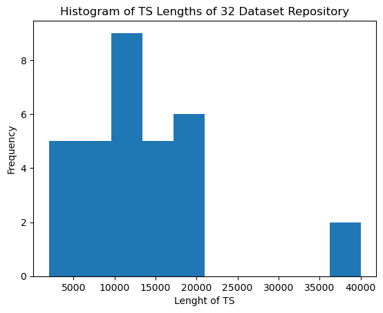
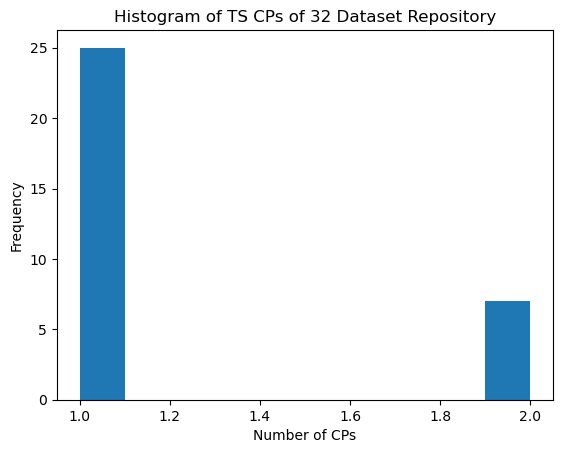

# UQ-TSS
Welcome to the repsitory for UQ-TSS!

UQ-TSS is a general framework for uncertainty quantification (UQ) of time series segmentation (TSS). UQ-TSS is designed to quantify uncertainty of any segmentation from any  given TSS method and time series (TS). UQ-TSS is an ensemble learning approach that estimates probability distributions of TSS output components: The CP presence and the CP location. UQ-TSS characterizes these distributions to yield final CP predictions and measure uncertainty of the entire segmentation. 

UQ-TSS provides new measures for TSS evaluation that do not rely on ground truth. UQ-TSS can help optimize hyper-parameters, create different interpretations of a segmentation, and refine segmentation results based on its uncertainty measures. 

## Datasets
The datasets from our experiments can be found from the following links.
PAMAP2: https://drive.google.com/drive/folders/1ECwHJetl8EPRkQSMD-rLuWimJ5kMp8qW

The 32 TS Repository can be found from the following authors: https://www.cs.ucr.edu/~eamonn/Segmentation_ICDM.pdf 

Properties of 32 TS Repository:

## Running UQ-TSS
We provide Jupyter Notebooks demonstrating UQ-TSS with PELT, FLOSS, CLaSP, and BOCPD. Please look in the folder "Jupyter Notebooks" 
